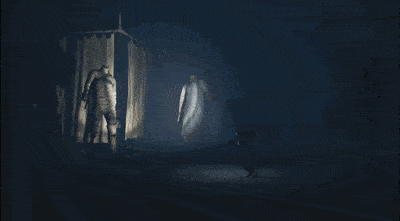

## 前言
为纪念我第一次使用手柄通关的《小小梦魇2》，也为自己为什么喜欢这款游戏作一个思考总结，这篇文章将谈谈这款游戏让我又爱又恨的地方：**它核心的恐怖感设计。**
## 概要
《小小梦魇2》是一款2.5D的以**解密**为核心的卡通画风的**恐怖**游戏。
> 该作中玩家扮演小孩摩诺，和电脑控制的前作主角小六协作求生，并揭开黑暗的秘密。——《维基百科》

游戏的几个主要场景为：森林、学校、医院、市区、灯塔（梦境）

<!-- more -->

## 恐怖感的设计体现

作为一款恐怖游戏，《小小梦魇2》并不是主打`Jump scare`的 *虽然里面仍有不少突然跳出来吓人的* ，而是主要在于营造恐怖氛围。
氛围设计是如何体现的呢？
1. 美术形象设计
    1. 己方人物
        能跟玩家交互的人物只有主角 **Mono** ,和电脑操控的 **小六** 。从外形上看两人体型都非常小，在没有特殊武器道具时，并不具备任何的攻击性手段。
    
        （图为游戏的宣传图，可以看出Mono和小六体型十分瘦小，旁边是凶险的敌人和陷阱）
    
    2. 敌方人物
        敌方人物主要能够分为两类。第一种是玩家可以通过灵活使用道具进行战斗来消灭的，比如在学校中遇到的小人、在医院遇到的会动的手，主要考验玩家对攻击时机的选择；第二类是玩家不能直接战胜，必须思考解密、进行灵活周旋的敌人，比如每一关都会有的BOSS,主要考察玩家对于道具和地图的使用。
        在敌方人物设计时，其大多都与人有关。比如刚才说到的小人和会动的手，学校里的女老师可以把脖子伸得特别长。在这种强化人类的某种特征的画风下，这种像人又不完全是的人的设定，产生了 **恐怖谷效应** ，令玩家产生恐惧感。
    
      
    
    （图为女老师伸脖子追杀Mono的情景）  
    
2. 玩家操作
    1. 视角控制
    在《小小梦魇2》中，玩家主要通过特定的视角进行操作，也可以通过手柄的右摇杆进行调整，但是被限制的非常死，可以操控的范围很小，所以基本上想要得到更多的关于场景的信息，玩家将不得不进行移动来观察。这就使得玩家不能在绝对的安全区，对场景进行观察后，再进行操作游玩；而是始终让玩家处于不安全的位置，一边前进一边观察地图，决定下一步的动向。
    2. 移动模式
    玩家的移动方式分为三种，奔跑、走路、蹑足（下蹲）前行，通过手柄的正方形按钮和L1按钮。这三者中移动速度递减，产生的声音递增。有些特殊的平台或者沟道需要用到冲刺和下蹲前行，或者冲刺后进行滑铲，考验玩家对时机的把握能力。
    3. 互动设计
    玩家在操作场景中可以交互的道具时，比如拾取道具、攀爬物品、拿到武器，玩家必须一直摁着手柄的交互按钮，增加玩家的操作内容。并且在特殊的场景时，玩家会从手柄处接受到强烈的反馈，尤其是在后期，关卡中会要求玩家同时进行多种操作，提高关卡的难度和玩家的紧张程度。
    4. 战斗方式
    除去剧情杀，玩家的攻击手段主要靠拾取地上的锤子或铁棍，对前方进行攻击。
    在战斗中，玩家有任何的失误都会导致死亡，所以玩家要保持高度的专注。
    攻击的前后摇特别长，Mono在执行攻击动作时，有一段长长的将锤子举过头顶挥击的动作；在执行攻击动作后，Mono会有一段时间不能操控，等待恢复体力收回锤子。在面对多个敌人时，需要玩家掌握好攻击时机的同时，也要规划好路线，保证在攻击前后的疲软期不被攻击。
    在这种战斗模式的作用下，玩家能够体验到与其他游戏中战斗的爽快感相反的脆弱无力感，需要玩家小小翼翼进行操作，保证了紧张感。
    
3. 场景设计
    游戏中主要的场景大多数玩家在日常生活中有一定的了解。游戏在设计场景时，以日常生活为基底，进行改造使之具有恐怖感。

   1. 发掘内心中的恐惧
    在游戏的宏大的场景，比如高楼之间，海边时，玩家操控的瘦小的Mono会在与这些场景对比中或者与巨型的敌人对比反差，显得十分的渺小与无助。
       在游戏中还有很多地方会出现人类的器官，比如像蜘蛛一样移动的手、被装载罐子里的大脑和内脏。并且在游戏的大多场景中，光源都十分的少，且亮度不足，还伴有闪烁的效果，给人以阴森的不安全感。在声音上，游戏中的解密场景大多是寂静的，只有主角与场景互动的声音；而与BOSS交互的场景里，游戏刻意地强化了BOSS的音效，并且让玩家能够体验到心跳的声音，搭配上强烈的手柄的振动，十分具有沉浸感。
       
       

    
   
   2. 黑童话色彩
    游戏借鉴了现实生活里的恐怖场景，比如医院的停尸间、学校的霸凌。并且用阴森的音乐、昏暗的灯光、道具进行烘托。比如医院停尸间的`123木头人`，在这一关中，有会动的骨骼架追捕Mono,玩家需要一边移动一边调整视角使能够始终用手电筒照射他们使之停下。*然而有玩家发现可以一直旋转手电筒直接过关*

    
   
   3. 灵异色彩
    游戏中有不少奇特的元素，比如既能够吸引敌人也可以进行传送的电视机，玩家需要运用这两个特性来解密。
   
    ## 一点点感想总结
   
    说了这么多《小小梦魇2》做的好的地方，但是该游戏中还是有许多地方值得改善。举个例子，视角上来说，游戏属于2.5D游戏，在涉及到镜头前后方向上移动或者方向选择时，比如挥击锤子、逃跑时路线选择。如果因为游戏设计本身带来的视觉差异，使玩家一次又一次因为非自身元素而死亡重来，很容易使玩家体验到的恐怖变成烦躁，让玩家少了游戏体验效果。不过总的来说，《小小梦魇2》仍然是一款瑕不掩瑜的佳作，值得你花上一个周末一玩。
   
    

