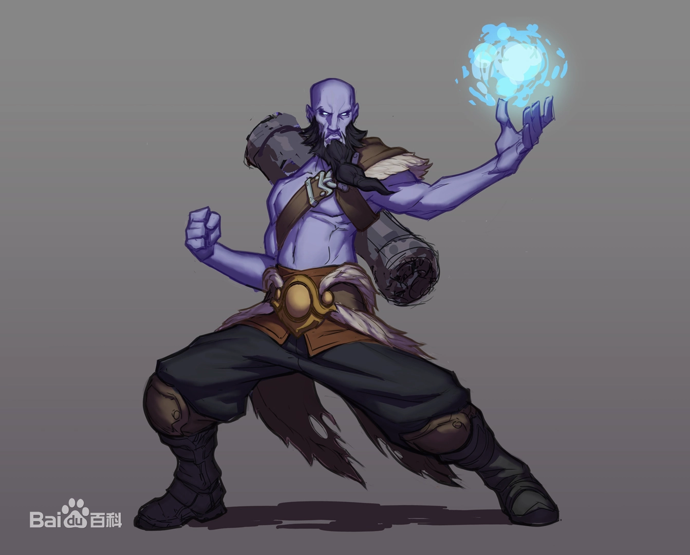
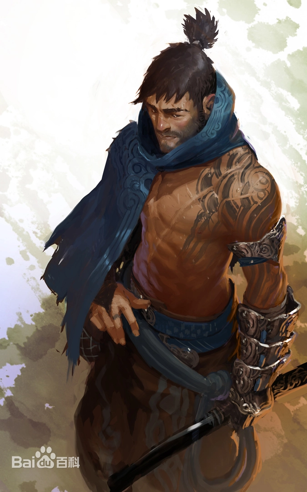
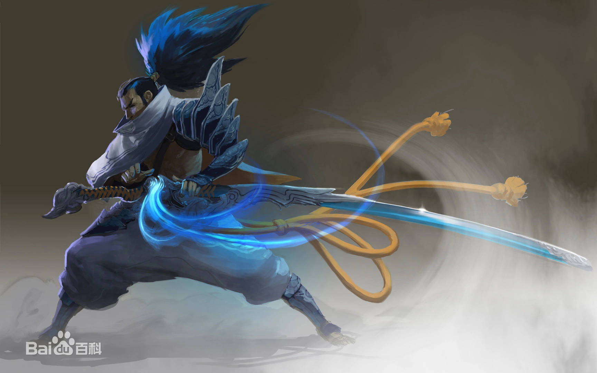
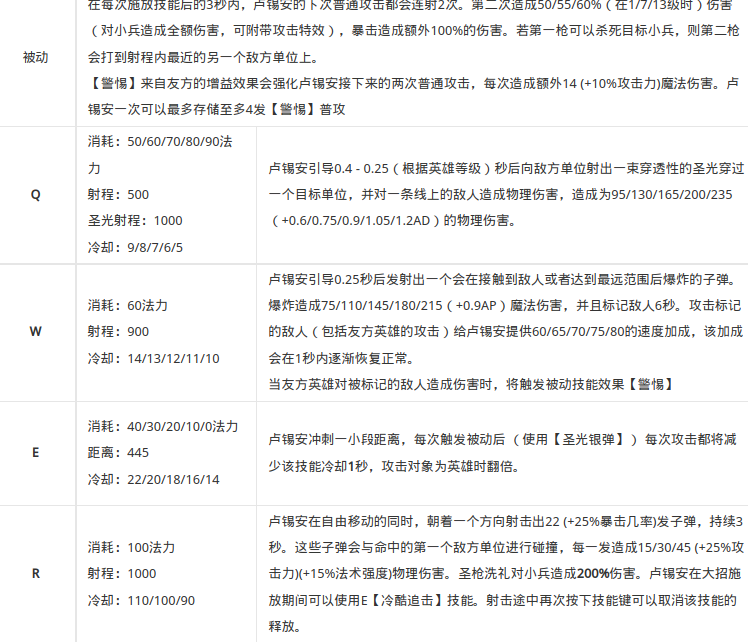

# 角色设计方法论

《英雄联盟》宇宙是通过英雄来贯穿的，虽然其实它并不是以角色为核心的游戏
## 三种驱动方式
1. 设计驱动
2. 故事驱动
3. 艺术驱动

<!-- more -->

## 明确定位，你所准备的角色究竟是一个怎样的角色  

玩法设计：角色的技能是什么，表现水平如何

角色故事：角色是谁，他的背景故事以及与其他角色之间的联系，他对世界的看法

形象设计：角色的形象、画风、技能特效等

### 角色设计的目的是使玩家与角色产生共鸣

jinx：天才、瘦削、情绪非常不稳定

亚索：天才御风剑客，被诬陷，流浪人间
根据角色故事设计，对角色形象进行特色化设计，能够使游戏ip更具特色

比如从法师这个关键词产生的联想：高高的帽子？拿着法杖？
瑞兹：一个裸着蓝色上身背着一个大大的卷轴的会念咒语老法师

> 对角色设计保持灵活和开放是很有必要的：
> 一个会说话的浣熊，他最好的朋友是一棵树，再加上80年代的半身游侠，再来一只绿色的卡魔拉  ==>>《银河护卫队》

一个核心要素 基于核心要素构建一个丰满的人物形象

玩法 角色 形象三位一体 技能之间需要有连携性 始终不要偏离最基本的核心要素和主题

# Moba角色技能与玩法设计
首先给出循环图
基础技能组，核心玩法，功能定位，角色设定
基础技能组通过combo连招，找到角色的对应核心玩法，根据其核心玩法确定其定位及功能，再回过头来强化角色的设定

(该循环图来自[MOBA游戏作坊 ——如何打造人气英雄](https://gameinstitute.qq.com/article/10023))

之后以两个案例介绍角色设计
案例一  
以故事设计为出发点

- 如孤魂一般，伤心地在世界各地游荡

- 被远古的魔法所诅咒，他的触碰带着死亡与毁灭

- 很多传说和神话都由他而起
      
  玩法设计
  
  

这个角色是阿木木。

定位：带有控制技能保护队友的坦克

> 但从这个案例中我们发现一个问题是：视觉上看起来完全不像一个坦克，并且给人的感觉是他好像是一个需要被保护的，而不是保护其他人，还有，也感觉不到这个角色很危险，带着死亡与毁灭。所以，阿木木这个角色的造型跟他的主题其实很不搭。其实《英雄联盟》早期的角色虽然很多，很有特色，但是他们有很多的问题，即他们在设计上的黄金三角之间是互相不呼应的。我们在早期的《英雄联盟》的英雄设计里面学到了：**我们所有的设计应该构架在他人认知之上。**

认知的展现：

- 颜色：冷暖色

- 形状，尖锐、平缓
- 声音：刺耳、舒缓
- 光影：阴暗程度

具体步骤：
1.早期探索
2.确定其核心设计
3.丰富完善设计

角色设计的核心支柱核心支柱的定义：定义什么是最重要的帮助我们做艰难的决定帮助我们推进设计通常是全局性的，非细节的最多不超过三个支柱英雄设计核心支柱的运用设计每位英雄都必须要回答的三个问题：

1. 为什么？他/她的目的是什么？比如，你可能不会去怀疑为什么NPC在那儿站一个星期了还在那站着，但是一个你真正会去关心的角色他应该有他自己的目的。

2. 是什么？他/她的外观是什么样的？性格？个性？怎么样? 

3. 他/她有什么样的特殊才能能帮助他/她实现自己的目标。

接下来将从具体开发的流程，介绍一位角色的设计
那个男人....：
两张图片

支柱1：亚索是一位传奇的剑客；
支柱2：他能熟练地掌握用剑御风的技术；
支柱3：他以前是一位伟大的战士，但是现在却落魄一人逃亡。
美术上：
剑的形状，龙纹——艾欧尼亚的传统，夸张的头发和披风——体现风的特点，蓝色为主色调，黄色为衬托——象征自由和荣耀
玩法上：
从风的角度，Q积攒旋风并释放，W一个强力的阻挡地方飞行道具的神技，R对新手很不友好，只有在敌方被击飞时才能使用，需要很高的熟练度——
故事上
亚索其实在他黄金时代的时候是一个很骄傲的剑客，是剑客学校最优秀的剑客。后被诬陷，他的哥哥为了教会他要有耐心，找到事情的真相，最后在跟他的对决中他哥哥牺牲了自己，但是教会了他如何去面对荣耀和死亡。

## 技能设计，做一个好玩的角色

1. 操作上给玩家设置挑战
   - 速度挑战
   
     - 反应速度
     - 技能连招的释放速度
   
   - 精度挑战（延迟类技能、小范围技能）
   
     - 动态判定效果
   - 为技能设计多个判定区域和效果
   
2. 给玩家施展策略的机会

   - 外显型策略

     强引导，设计师教你怎么玩游戏，比如每进行一次普通攻击减少一次某某技能CD。

   - 学习型策略

     让玩家在游戏中学习到角色的新的玩法用法

     - 隐性的搭配组合？

       技能组合使用能够获得额外的效果，但是也要保证技能主要是分开使用，保证技能的独立性，而非强行捆绑。
     
     - 最大化收益
     
       为技能的数值设定上下限，让玩家主动去追求收益最大化。
     
     - 组合型战略
     
       在多次实战时，玩家会发现不同角色的技能之间存在着关联效果，可以作为配合使用或者需要避免搭配组合。

3. 引入新的乐趣点

   叠层？收集？预判？规划？

# 对角色进行打磨 

## 能力定位

它的定位是什么？
这位角色的强势的点是什么？
什么时候开始发力？
对于装备是否有依赖性？
是否与其他的角色存在组合效果？

1. **作为前期英雄，设计师需要关注的是英雄在前期线上有无足够强的压制能力**，例如前期英雄能够通过CD较短的技能来压制对面的发育，而且他的输出能力一定是偏单体攻击的。
2. **中期英雄的设计则需要在中期有一方面的突出能力，比如机动性、控制能力等等。**假设英雄在中期有一个特殊能力或者比较突出的技能，他就能有效地发起小规模战斗来带动整个游戏节奏。
3. **而在后期英雄的设计上，往往需要限制前期技能效果。**假如一个英雄的技能成长性高，或者一个英雄依赖多件核心装备的获取，这都属于偏后期的设计。那么在这种设计下，设计师就会对后期英雄做出一定限制，例如前期对线能力的削弱等等。

##  成长性分析

每个英雄包括被动，共有五个技能，角色的技能的效果或者数值都会随着技能等级的提升，从而得到提高。这种提升的并非指一般的随着技能等级提升，技能伤害的数值得到增强。而更多的指技能的效果提升得到质的提升，比如技能的属性加成，或者得到阶跃性增强。一般来说，五个技能中，有这种提升的技能越多，英雄角色的成长性就越强。比如说英雄联盟中，卢仙的技能提升在于被动，Q和E,当这三个技能差不多都升到满级时，就意味者到达了这个角色的强势期，在实际验证中也确实符合具体数据。根据这种方式，可以确认一个英雄的成长性和强势期验证。

可以这么说，一个英雄的成长性的技能越多，这个英雄的后期能力就会越强，所以发力期也在后期，但是因为需要做到游戏内的平衡，在前期做不到过于强势。

而强势期一般指的是最为重要的技能得到完全提升时，角色所在的时期。比如刚才所说的卢仙，Q升到满级时伤害得到了保证，E升到满级时，CD减短并且消耗得到了显著降低，保证了灵活性。并且在13级时被动的双枪效果也能得到加成的提高。

## 战术分析

从游戏的具体场景中验证角色技能组的可行性。从已知的技能设计，为其推出相应的玩法。

玩法上可以从游戏的不同时期的侧重点，技能Combo，技巧；和为其进行相应的出装探索。

## 可反制性

一般情况下，是先设计机制，然后为机制赋予数值，根据实际的反馈，对数值进行修改，或者重新设计
技能由 伤害，控制，回复，增益，位移 作为基本元素所构成，而机制就是缝出来的效果，比如：
R，对友方进行回复，对敌方进行击退——辅助
R：进行一段位移，并对低生命值敌人造成斩杀，然后通过拾取灵魂，使用敌方英雄并刷新R——收割型刺客or战士

根据其技能机制，需要对其做出**反制**，这也是moba游戏的魅力，一物降一物，从来没有最优解。

## 生态环境补充

游戏环境缺什么？ 就补什么
游戏环境什么过于强力？刻意制造天敌

# 参考资料

1. [MOBA游戏作坊 ——如何打造人气英雄](https://gameinstitute.qq.com/article/10023)
2. [我们是如何打造《英雄联盟》IP宇宙的？](https://gameinstitute.qq.com/course/detail/10186)
